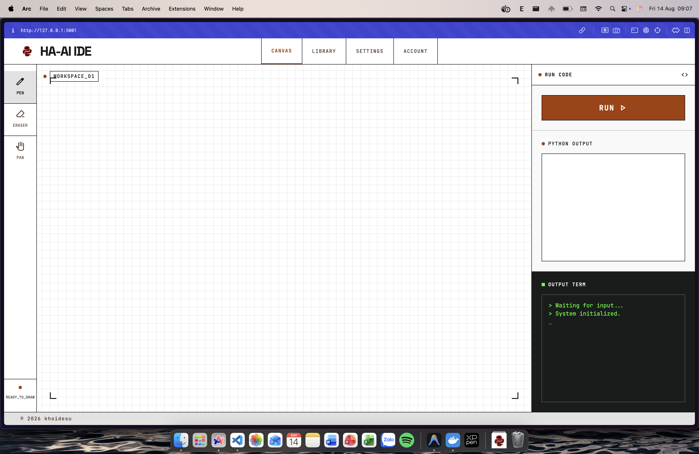
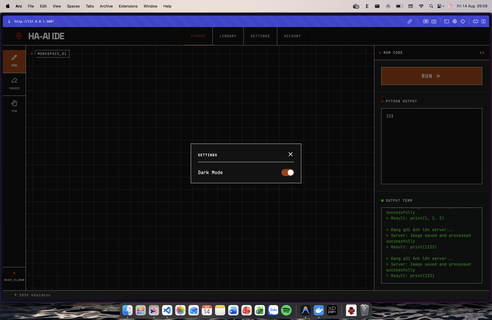
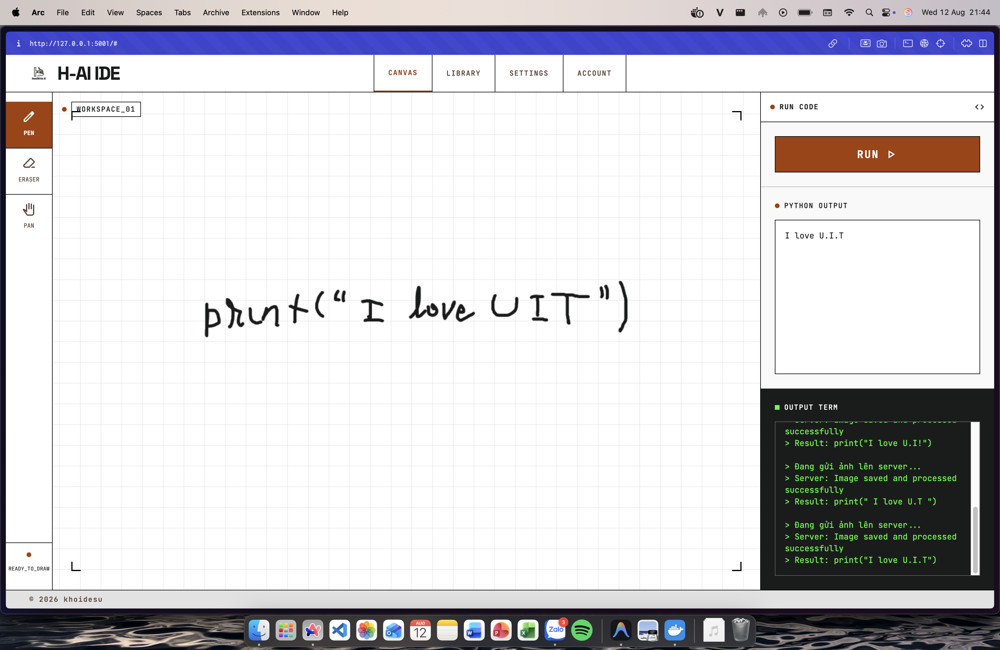
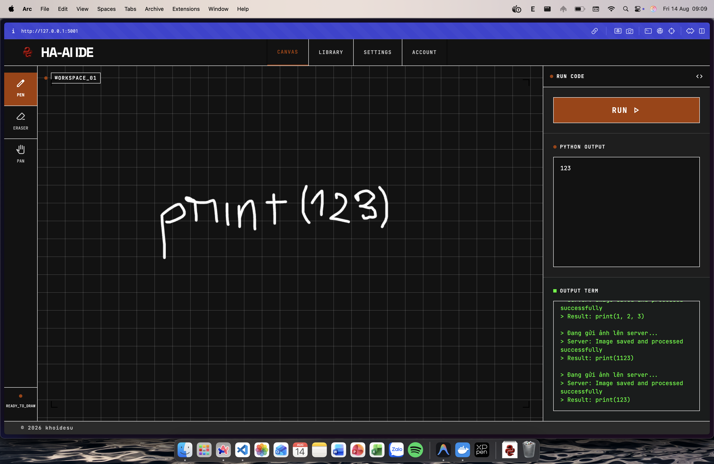
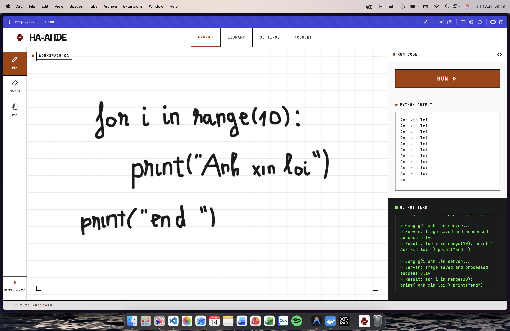
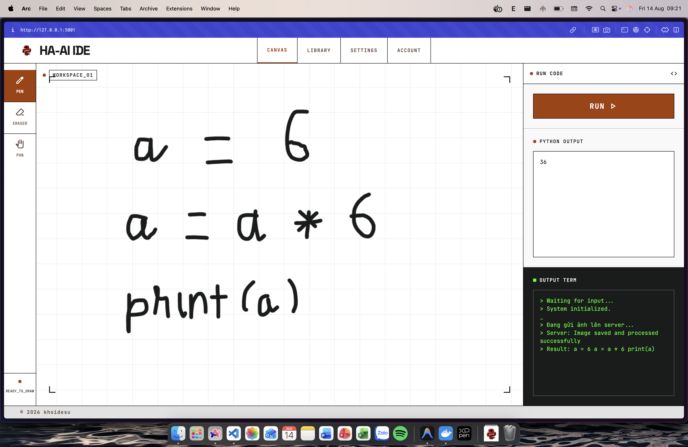
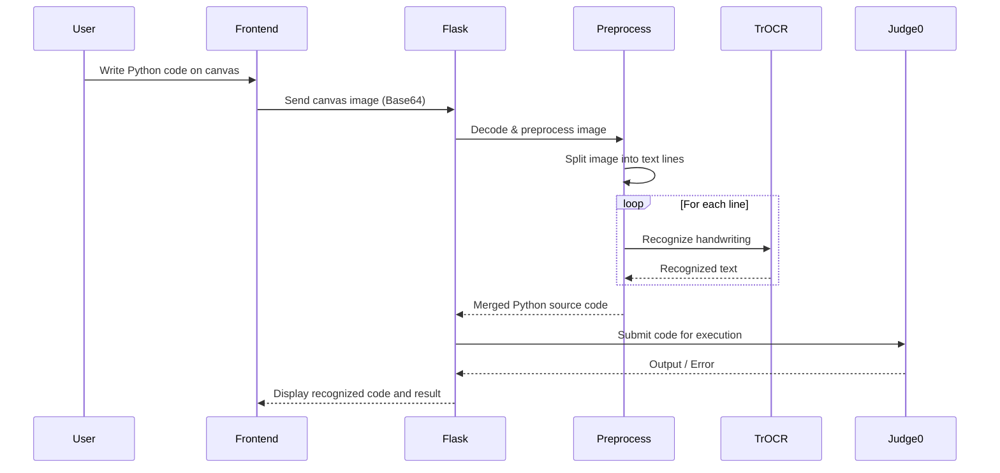

<div align="center">

# HANDWRITEN AI CODE EDITOR

</br>
<em>A web application that allows users to write, recognize, and execute handwritten Python code in real time.</em>

[](https://img.shields.io/badge/logo-HTML5-e34f26?logo=html5&label=&labelColor=555555&logoColor=white)
[](https://img.shields.io/badge/CSS-639?logo=css&logoColor=fff)
[](https://img.shields.io/badge/JavaScript-F7DF1E?&logo=javascript&logoColor=black)

[](https://shields.io/badge/python-3.11+-blue)
[](https://img.shields.io/badge/Flask-000000?logo=flask&logoColor=white)
[](https://img.shields.io/badge/Tools-OpenCV-informational?style=flat&logo=OpenCV&logoColor=white&color=2bbc8a)
[](https://img.shields.io/badge/-PyTorch-333?style=flat&logo=pytorch)
[](https://img.shields.io/badge/-HuggingFace-3B4252?style=flat&logo=huggingface&logoColor=)
[](https://img.shields.io/badge/AI-Google%20Gemini-blue)
[](#)

</div>

## ⚡ Overview

**Handwritten Code Editor** is an AI-powered web application that allows users to write Python code by hand on a digital canvas, automatically recognizes the handwritten code using Optical Character Recognition (OCR), corrects common recognition errors, and executes the code in a secure sandbox environment.

The project aims to bridge the gap between handwritten programming and code execution, providing an intuitive interface for learning, teaching, and experimenting with handwritten code.

> You only need to:
>
> 1. Write your Python code on the canvas.
> 2. Click **Run**.
> 3. Wait for the OCR to recognize your handwriting.
> 4. The recognized code will be executed by the local Judge0 server.
> 5. View the output directly in the browser.

### Our Vision

Our vision is to make programming more natural and accessible by allowing developers, students or scientists to write code as they would on paper while still benefiting from instant code execution. We aim to improve handwriting recognition accuracy through continuous OCR optimization and model fine-tuning, creating a practical tool for learning, teaching, and rapid prototyping.

## 📸 Screenshots

<div align="center">
<table>
<tr>
<td></td>
<td></td>
</tr>
<tr>
<td></td>
<td></td>
</tr>
<tr>
<td></td>
<td></td>
</tr>
</table>
</div>

## 🎬 Demo Videos

### 1. Wuhan University Public Opinion Simulation + MiroFish Project Introduction

<div align="center">
<a href="https://www.bilibili.com/video/BV1VYBsBHEMY/" target="_blank"></a>

</div>

## 🛠️ Tech Stack

### Frontend

- **HTML5, CSS3, JavaScript (Vanilla JS)**  
  Designed by Google Stitch, builds the user interface, including the infinite drawing canvas and mouse-based drawing/erasing interactions.

- **Tailwind CSS (CDN)**  
  Provides responsive layouts, modern styling, and built-in Dark Mode support.

---

### Backend

- **Python 3.11+**  
  The primary programming language for the backend services.

- **Flask**  
  A lightweight web framework used to build the REST API that receives images from the frontend and coordinates the OCR pipeline.

- **python-dotenv**  
  Loads environment variables (such as API keys and configuration) from a `.env` file.

---

### AI & Computer Vision

- **Microsoft TrOCR (`microsoft/trocr-base-handwritten`)**  
  The core handwritten text recognition model used to convert handwritten Python code into editable text.

- **PyTorch (`torch`)**  
  Deep learning framework used to run the TrOCR model.

- **Hugging Face Transformers**  
  Provides the interface for loading and performing inference with TrOCR.

- **OpenCV (`opencv-python`) & NumPy**  
  Used for image preprocessing, including noise removal, image enhancement, and handwritten line segmentation before OCR.

- **Pillow (PIL)**  
  Handles image format conversion and image manipulation.

- **Google Generative AI (Gemini API)**  
  Analyzes the recognized source code, detects OCR-related mistakes, and automatically suggests or generates corrected code.

---

### Secure Code Execution

- **Judge0**  
  Executes the recognized Python code inside a secure sandbox environment and returns the execution result.

- **Docker & Docker Compose**  
  Hosts Judge0 and its required services (Server, Worker, Redis, and PostgreSQL) in isolated containers, ensuring safe and reliable local code execution.

## 🔄 Workflow



## 🚀 Quick Start

A web-based handwritten code editor that uses AI (TrOCR & Gemini) to recognize handwritten code and executes it safely using Judge0 in an isolated environment.

## Prerequisites

| Tool               | Version     | Description                                               | Check Installation       |
| ------------------ | ----------- | --------------------------------------------------------- | ------------------------ |
| **Python**         | ≥3.11       | Backend runtime (Flask) & AI execution (TrOCR)            | `python3 --version`      |
| **pip**            | Latest      | Python package manager (for `requirements.txt`)           | `pip --version`          |
| **Docker**         | Latest      | Container engine required for Judge0 sandboxing           | `docker --version`       |
| **Docker Compose** | V2 (Latest) | Orchestrating Judge0 services (Server, Worker, Redis, DB) | `docker compose version` |
| **Git**            | Latest      | Version control system                                    | `git --version`          |

## Getting Started

Follow these steps to set up and run the project locally.

### 1. Clone the repository

```bash
git clone ''
cd handwritten-code-editor
```

### 2. Setup Python Environment

It is highly recommended to use a virtual environment.

```bash
# Create a virtual environment (replace python3.11 with your python command if needed)
python3 -m venv .venv

# Activate the virtual environment
# On macOS/Linux:
source .venv/bin/activate
# On Windows:
# .venv\Scripts\activate

# Install all required Python packages
pip install -r requirements.txt
```

### 3. Setup Environment Variables

Copy the example environment file and add your Gemini API Key.

```bash
cp .env.example .env
```

Open the `.env` file and replace `your_gemini_api_key_here` with your actual Gemini API Key from [Google AI Studio](https://aistudio.google.com/api-keys).

### 4. Download the AI Model Locally

Since the TrOCR model is too large to host on GitHub, you need to download it into the `models` directory. You can do this easily using Python:

```bash
# Ensure huggingface-cli is installed (or use hf-transfer)
pip install -U "huggingface_hub[cli]"

# Create the models directory
mkdir models

# Download the model to the local directory
hf download microsoft/trocr-base-handwritten \
    --local-dir models/trocr-base-handwritten
```

### 5. Start Judge0 (Code Execution Engine)

The project relies on [Judge0](https://python.docs.judge0.com/master/index.html) to safely execute code. You must have [Docker](https://www.docker.com/products/docker-desktop/) running.

First, download and configure Judge0:

```bash
# Create a directory for Judge0
mkdir -p judge0
cd judge0

# Clone the stable release (v1.13.1)
git clone -b v1.13.1 https://github.com/judge0/judge0.git

cd judge0
```

Then start the Judge0 services:

```bash
# Start the database and redis first
docker compose up -d db redis

# Wait ~10 seconds for the database to fully initialize before starting the rest
sleep 10
docker compose up -d

# Return to the project root
cd ../..
```

_Note: Wait a few seconds for the worker containers to fully initialize before running code._

### 6. Run the Backend Server

Once all dependencies are installed and Docker is running, you can start the Flask app:

```bash
python3 app.py
```

_Note: The first time you run this, the TrOCR AI model (`microsoft/trocr-base-handwritten`) will be downloaded from Hugging Face (~1.5GB) if it isn't found locally. This might take a few minutes depending on your network speed._

### 7. Access the Application

Open your web browser and go to:
[http://127.0.0.1:5001](http://127.0.0.1:5001)

You can now draw your handwritten code on the canvas, press **RUN**, and watch the magic happen!
